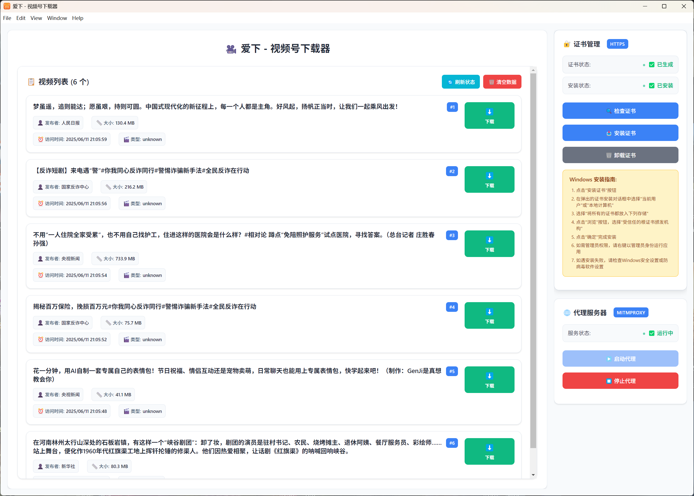

<div align="center">
  

  # 爱下 - 微信视频号下载器

  <p>
    <strong>一款专业的微信视频号内容下载工具</strong>
  </p>

  <p>
    
    
    
    
    
  </p>

  <p>
    <a href="#功能特性">功能特性</a> •
    <a href="#软件截图">软件截图</a> •
    <a href="#快速开始">快速开始</a> •
    <a href="#下载安装">下载安装</a> •
    <a href="#使用指南">使用指南</a> •
    <a href="#常见问题">常见问题</a> •
    <a href="#贡献指南">贡献</a> •
    <a href="#支持我们">支持我们</a>
  </p>
</div>

---

## 📱 产品介绍

**爱下**是一款基于 Electron + Vue 3 开发的跨平台微信视频号下载工具。通过智能代理技术，实现对微信视频号内容的自动监控、捕获和批量下载，为内容创作者和研究人员提供便捷的素材收集解决方案。

## 📸 软件截图

<div align="center">
  
  <p><em>爱下主界面 - 现代化设计，功能丰富</em></p>
</div>

### 🎯 设计理念

- **🔒 安全第一**: 本地处理，隐私保护，无数据上传
- **⚡ 高效便捷**: 自动化流程，批量操作，节省时间
- **🎨 用户友好**: 现代化界面，直观操作，零学习成本
- **🛡️ 稳定可靠**: 异常处理，错误恢复，持续稳定运行

## ✨ 功能特性

### 🎬 核心功能
- **智能监控**: 自动监控微信视频号页面，实时捕获视频数据
- **批量下载**: 支持多任务并发下载，进度实时显示
- **格式支持**: 支持主流视频格式，保持原始画质
- **断点续传**: 网络中断自动恢复，避免重复下载

### 🔧 技术特性
- **透明代理**: 内置HTTP/HTTPS代理服务器，流量拦截分析
- **证书管理**: 自动生成和管理SSL证书，确保HTTPS访问
- **跨平台**: 支持 Windows、macOS、Linux 多平台运行
- **现代架构**: 基于 Electron 33+ 和 Vue 3 最新技术栈

### 🎨 界面特性
- **响应式设计**: 适配不同屏幕尺寸，移动端友好
- **实时状态**: 监控面板显示代理状态、请求统计
- **美观界面**: 现代化设计风格，流畅交互体验
- **主题适配**: 支持浅色/深色主题自动切换

### 🛡️ 安全特性
- **本地处理**: 所有数据处理均在本地完成，无隐私泄露
- **权限控制**: 最小权限原则，仅请求必要系统权限
- **代码保护**: 生产版本采用代码混淆技术保护
- **更新机制**: 内置自动更新功能，及时修复安全问题

## 🚀 快速开始

### 📋 系统要求

| 平台 | 最低版本 | 推荐版本 | 特殊要求 |
|------|----------|----------|----------|
| Windows | Windows 10 | Windows 11 | 需要管理员权限安装证书 |
| macOS | macOS 10.15 | macOS 12+ | 需要信任开发者证书 |

### 💿 环境要求

- **Node.js**: >= 16.0.0 (推荐 LTS 版本)
- **内存**: >= 4GB RAM
- **存储**: >= 500MB 可用空间
- **网络**: 稳定的互联网连接

## 📥 下载安装

### 🎁 预编译版本 (推荐)

从 [Releases](https://github.com/wxdown-team/wxdown-wechat-video-downloader/releases) 页面下载适合您系统的安装包：


### 🛠️ 从源码构建

#### 1. 克隆仓库
```bash
git clone https://github.com/wxdown-team/wxdown-wechat-video-downloader.git
cd wxdown-wechat-video-downloader
```

#### 2. 安装依赖
```bash
# 使用 npm
npm install

# 或使用 pnpm (推荐)
pnpm install

# 或使用 yarn
yarn install
```

#### 3. 开发模式运行
```bash
npm run dev
# 或
pnpm dev
```

#### 4. 构建生产版本
```bash
# Windows
npm run build:win

# macOS
npm run build:mac

# Linux
npm run build:linux

# 所有平台
npm run build:all
```

## 📖 使用指南

### 🎯 初次使用

#### 1. 安装应用
- 下载对应平台的安装包
- **Windows**: 以管理员身份运行安装程序
- **macOS**: 拖拽到应用程序文件夹，首次运行需要信任

#### 2. 证书配置
首次启动时，应用会自动引导您完成证书安装：

```
1. 启动应用，点击"安装证书"按钮
2. 按照系统提示添加证书到信任列表
3. 重启浏览器使证书生效
4. 证书位置：应用数据目录/.http-mitm-proxy/certs/
```

#### 3. 启动代理服务
```
1. 在应用主界面点击"启动代理"
2. 确认代理服务状态显示为"运行中"
3. 代理地址：127.0.0.1:57392 (自动配置)
```

### 🎮 基本操作

#### 监控视频
1. **启动监控**: 确保代理服务已启动
2. **访问微信**: 在微信客户端访问视频号
3. **自动捕获**: 应用会自动捕获并显示视频信息
4. **实时更新**: 视频列表实时更新，显示最新捕获内容

#### 下载管理
1. **选择视频**: 在视频列表中选择要下载的内容
2. **批量操作**: 可同时选择多个视频进行批量下载
3. **监控进度**: 实时查看下载进度、速度和剩余时间
4. **文件管理**: 下载完成后可直接打开文件所在位置（本机下载目录/WechatVideos）


## 🐛 常见问题

<details>
<summary><strong>🔒 证书相关问题</strong></summary>

**Q: 提示证书错误或HTTPS连接失败**
```
A: 1. 确保以管理员身份运行应用
   2. 重新安装证书到系统信任根证书存储
   3. 重启浏览器和微信客户端
   4. 检查防火墙和杀毒软件设置
```

**Q: macOS提示证书不受信任**
```
A: 1. 打开"钥匙串访问" -> "系统"
   2. 找到"http-mitm-proxy"证书
   3. 双击 -> "信任" -> "始终信任"
   4. 输入管理员密码确认
```
</details>

<details>
<summary><strong>🌐 网络连接问题</strong></summary>

**Q: 代理服务启动失败**
```
A: 1. 检查端口57392是否被占用
   2. 临时关闭防火墙和代理软件
   3. 使用管理员权限启动应用
   4. 更换代理端口重试
```

**Q: 无法捕获微信视频**
```
A: 1. 确认代理服务状态为"运行中"
   2. 检查微信是否使用了应用代理
   3. 清除微信缓存重新登录
   4. 尝试重启应用和微信
```
</details>

<details>
<summary><strong>📥 下载相关问题</strong></summary>

**Q: 下载速度很慢或经常中断**
```
A: 1. 检查网络连接质量
   2. 降低并发下载数量
   3. 调整下载块大小设置
   4. 更换网络环境重试
```

**Q: 下载的视频文件损坏**
```
A: 1. 重新下载该视频文件
   2. 检查磁盘空间是否充足
   3. 确认原始视频URL有效性
   4. 尝试更换下载路径
```
</details>

## 🛠️ 开发指南

### 🏗️ 项目结构

```
electron-wexin-channels-downloader/
├── 📁 build/                  # 构建资源
│   ├── icon.ico              # Windows图标
│   ├── icon.icns             # macOS图标
│   └── icon.png              # 通用图标
├── 📁 src/                   # 源代码
│   ├── 📁 main/              # 主进程
│   │   ├── index.js          # 主入口
│   │   ├── proxy-manager.js  # 代理管理
│   │   └── certificate/      # 证书管理
│   ├── 📁 renderer/          # 渲染进程
│   │   ├── index.html        # HTML入口
│   │   └── src/
│   │       ├── App.vue       # 主应用组件
│   │       ├── main.js       # 渲染进程入口
│   │       └── components/   # Vue组件
│   └── 📁 preload/           # 预加载脚本
│       └── index.js          # IPC通信桥梁
├── 📄 package.json           # 项目配置
├── 📄 electron-builder.yml   # 构建配置
└── 📄 README.md             # 项目文档
```

### 🔧 技术栈

- **前端框架**: Vue 3 + Composition API
- **桌面框架**: Electron 33+
- **构建工具**: Vite + electron-vite
- **包管理**: npm/pnpm/yarn
- **打包工具**: electron-builder
- **代理库**: http-mitm-proxy
- **UI库**: 原生CSS + 响应式设计

### 🚀 开发环境搭建

1. **环境要求**
   ```bash
   node --version  # >= 16.0.0
   npm --version   # >= 8.0.0
   ```

2. **克隆项目**
   ```bash
   git clone https://github.com/wxdown-team/wxdown-wechat-video-downloader.git
   cd wxdown-wechat-video-downloader
   ```

3. **安装依赖**
   ```bash
   npm install
   ```

4. **启动开发服务**
   ```bash
   npm dev
   ```

5. **代码规范**
   ```bash
   npm lint    # ESLint检查
   npm format  # Prettier格式化
   ```

## 🤝 贡献指南

我们欢迎所有形式的贡献！无论是错误报告、功能建议还是代码提交。

### 🐛 报告问题

在提交问题前，请：

1. **搜索现有问题**，避免重复提交
2. **使用问题模板**，提供详细信息
3. **包含系统信息**：操作系统、版本号、错误日志
4. **提供复现步骤**，帮助我们定位问题

### ✨ 功能建议

1. **开启讨论**，在Issues中描述您的想法
2. **说明使用场景**，解释为什么需要此功能
3. **提供设计稿**，如果有UI相关的建议
4. **考虑兼容性**，确保不影响现有功能

### 🔧 代码贡献

1. **Fork项目**并创建功能分支
   ```bash
   git checkout -b feature/amazing-feature
   ```

2. **遵循代码规范**
   ```bash
   pnpm lint
   pnpm format
   ```

3. **提交更改**使用规范的提交信息
   ```bash
   git commit -m "feat: add amazing feature"
   ```

4. **创建Pull Request**并详细描述更改内容

### 📝 提交规范

我们使用 [Conventional Commits](https://conventionalcommits.org/) 规范：

```
feat: 新功能
fix: 错误修复
docs: 文档更新
style: 代码格式
refactor: 代码重构
test: 测试相关
chore: 构建过程或辅助工具的变动
```

## 📄 许可证

本项目采用 [MIT 许可证](LICENSE)。

```
MIT License

Copyright (c) 2024 WxDown Team

Permission is hereby granted, free of charge, to any person obtaining a copy
of this software and associated documentation files (the "Software"), to deal
in the Software without restriction, including without limitation the rights
to use, copy, modify, merge, publish, distribute, sublicense, and/or sell
copies of the Software, and to permit persons to whom the Software is
furnished to do so, subject to the following conditions:

The above copyright notice and this permission notice shall be included in all
copies or substantial portions of the Software.
```

## 🙏 致谢

感谢以下优秀的开源项目：

- [Electron](https://electronjs.org/) - 跨平台桌面应用框架
- [Vue.js](https://vuejs.org/) - 渐进式JavaScript框架
- [Vite](https://vitejs.dev/) - 下一代前端构建工具
- [http-mitm-proxy](https://github.com/joeferner/node-http-mitm-proxy) - HTTP代理库

特别感谢所有贡献者和用户的支持！

## 💰 支持我们

如果这个项目对您有帮助，欢迎打赏支持我的开发工作！您的支持是我持续改进的动力。

<div align="center">
  <table>
    <tr>
      <td align="center">
        
        <br>
        <strong>微信打赏</strong>
      </td>
      <td align="center">
        
        <br>
        <strong>支付宝打赏</strong>
      </td>
    </tr>
  </table>
</div>

<div align="center">
  <p>
    <sub>🙏 您的每一份支持都是我前进的动力！</sub>
  </p>
</div>

## 📞 联系我们

- 🌐 **官方网站**: https://www.wxdown.xyz
- 🐛 **问题反馈**: [GitHub Issues](https://github.com/wxdown-team/wxdown-wechat-video-downloader/issues)
- 💬 **讨论交流**: [GitHub Discussions](https://github.com/wxdown-team/wxdown-wechat-video-downloader/discussions)
- 📧 **邮件联系**: huangzhaojian@gmail.com

---

<div align="center">
  <p>
    <strong>⭐ 如果这个项目对您有帮助，请给我们一个星星！</strong>
  </p>
  <p>
    <sub>Built with ❤️ by <a href="https://www.wxdown.xyz">Will.H</a></sub>
  </p>
</div>

## Recommended IDE Setup

- [VSCode](https://code.visualstudio.com/) + [ESLint](https://marketplace.visualstudio.com/items?itemName=dbaeumer.vscode-eslint) + [Prettier](https://marketplace.visualstudio.com/items?itemName=esbenp.prettier-vscode) + [Volar](https://marketplace.visualstudio.com/items?itemName=Vue.volar)

## Project Setup

### Install

```bash
$ pnpm install
```

### Development

```bash
$ pnpm dev
```

### Build

```bash
# For windows
$ pnpm build:win

# For macOS
$ pnpm build:mac

# For Linux
$ pnpm build:linux
```
